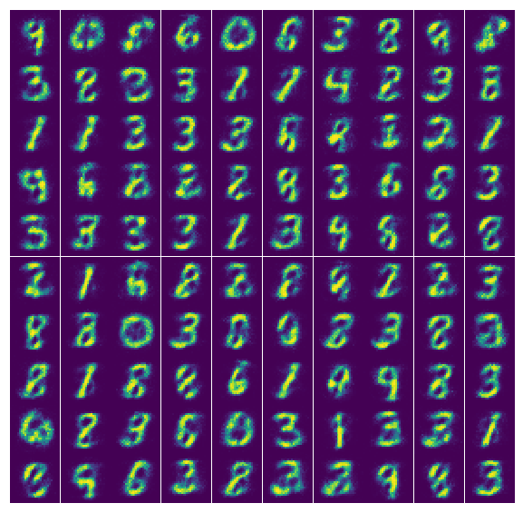

# RBM
Numpy implementation of Restriced Boltzman Machine.  
This model generates MNIST images using RBM. Constrative Divergence(CD) and persistent CD is implemeted. 
Deep Belief Network can construct by stacking RBMs. 

## File discription
- main.py: Main function of implemenation, construct the model, generates images, and calculate entropy of hidden unit
- model.py: RBM class(CD, PCD algorithms)
- downlad.py: Files for downlading MNIST data sets
- ops.py: Operation functions
- utils.py: Functions dealing with images processing.

## Usage
First, download dataset with:

    $ python download.py mnist

Second, write the main function with configuration you want.

## Results

